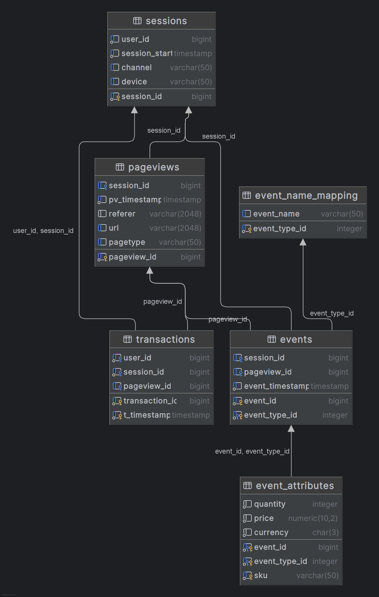
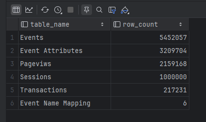

# BobaShop Analytics API
BobaShop is a online shop for everything related to Bubble Tea.
## Overview
This API provides high‑performance analytics backed by PostgreSQL. It reads from a read‑replica (slave) by default and automatically fails over to the master database if the replica becomes unavailable. Once the replica becomes healthy again, the API switches back automatically.

## Database Schema
### sessions
Tracks each website session including traffic channel and device information.

### pageviews
Stores each page view linked to a session.

### transactions
Represents completed purchases linked to sessions and pageviews.

### events
Stores user interaction events such as viewing cart or completing a purchase.

### event_attributes
Detailed attributes for events, such as SKU, price, quantity, etc.

## Failover Logic
1. The API prefers reading from the SLAVE database.
2. A background task checks SLAVE health every 15 seconds.
3. If SLAVE fails:
   - Reads switch to MASTER.
   - Failed queries automatically retry on MASTER.
4. When SLAVE recovers:
   - Reads switch back automatically.
5. Guarantees:
   - Zero downtime.
   - Always‑available read operations.
   - Automatic recovery without manual intervention.

## Endpoints
- Total pageviews
- Total users & sessions
- Sessions by channel
- Sessions by device
- Pageviews by pagetype
- Transaction summary
- Average order value
- Average cart value
- Transaction-level details

## Adding Schema Diagram
You can add an image using:

## Adding Table Row Counts
You can add an image using:

კომენტარები და შენიშვნები:
<ul> <li>ვეწამე პერფორმანსის გაუმჯობესებაზე. უფრო მეტი ფართიშენის გაკეთება მინდოდა მარა ვარჩიე primary და foreign key ები მქონოდა დიაგრამისთვის.</li>
<li>Distinct-ზე ძალიან მიზრდიდა runtime-ს და თითქმის სულ სცდებოდა 1 წამს, ძალიან მაინტერესებს სხვა რა ალტერნატივა არსებობს.</li>
<li>ყველა ცხრილი არ არის 1 000 000 იანი შინაარსიდან გამომდინარე, მაგრამ ოთხი მაინც არის.</li> 
<li>სლეივი და მასტერის ვიდეო მანამდე გადავიღე სანამ სქემას საბოლოო სახეს მივცემდი, მაგის მერე რამდენიმე ქოლუმი დავამატე ინდექსები შევცვალე. </li> </ul>
